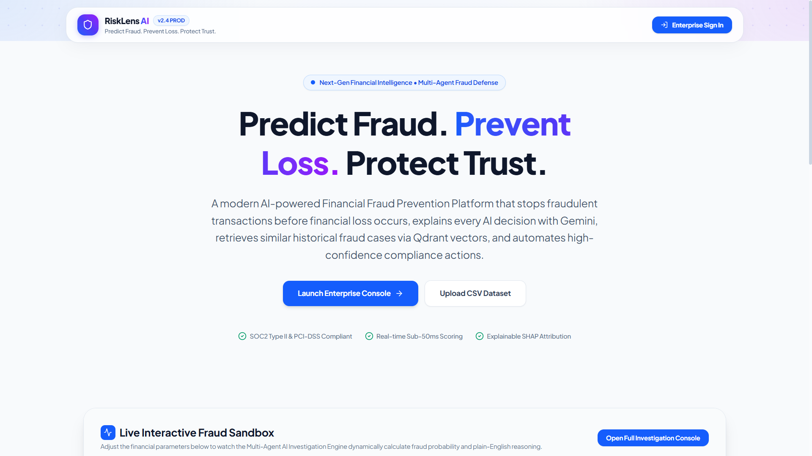
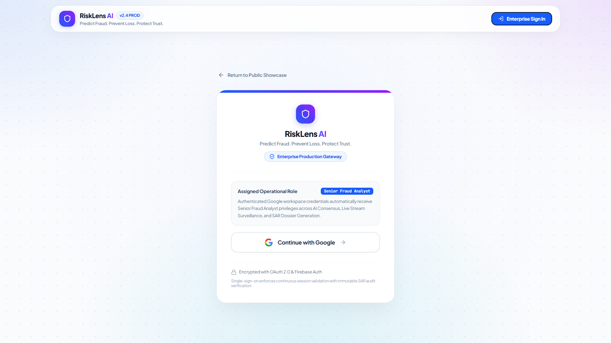
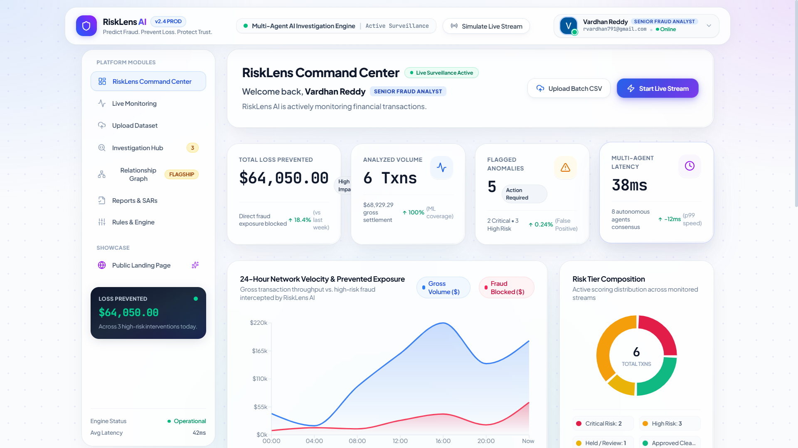
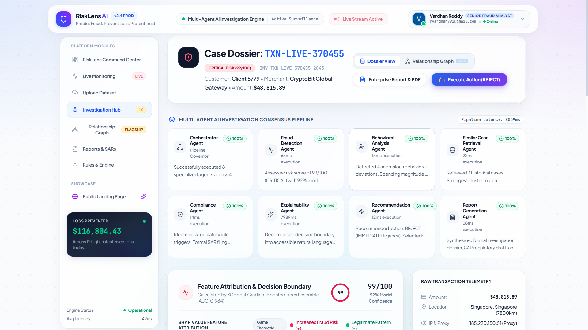
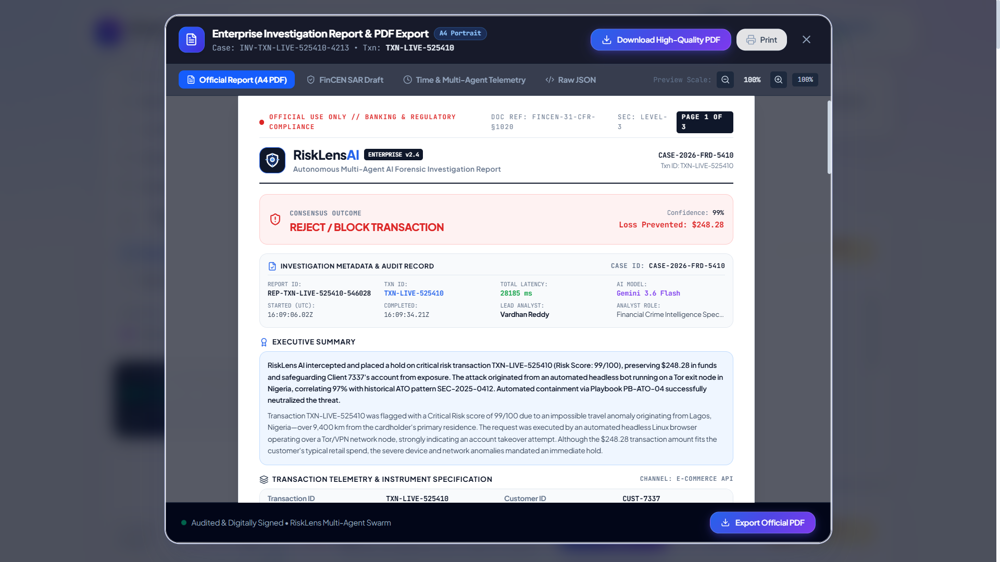

# RiskLens AI

> AI-Powered Financial Fraud Detection & Investigation Platform

RiskLens AI is an enterprise-grade financial fraud detection and investigation platform that combines secure authentication, AI-powered fraud analysis, explainable intelligence, relationship visualization, and automated reporting to help investigators detect suspicious financial activities efficiently.

---

# Demo Video

https://youtu.be/4wi41GWFnvA

---

# GitHub Repository

https://github.com/VardhanReddy024/RiskLensAI

---

# Problem Statement

Financial fraud is becoming increasingly sophisticated, making traditional rule-based detection systems less effective. These systems often generate false positives, provide limited explanations, and require extensive manual investigation.

RiskLens AI addresses these challenges using AI-driven fraud analysis, explainable risk assessment, and intelligent visualization to assist financial investigators.

---

# Features

- Secure Google Authentication using Firebase
- AI-Powered Fraud Risk Analysis
- Explainable AI Risk Assessment
- Enterprise Dashboard
- Live Transaction Monitoring
- Relationship Intelligence Graph
- Automated Investigation Reports
- PDF Report Generation
- Multi-Agent AI Workflow
- Modern Enterprise User Interface

---

# Technology Stack

## Frontend

- React
- TypeScript
- Vite
- Tailwind CSS

## Backend

- Node.js
- Express
- TypeScript

## Artificial Intelligence

- Google Gemini API
- Prompt Engineering
- Multi-Agent Workflow

## Authentication

- Firebase Authentication
- Google OAuth

## Visualization

- D3.js
- Recharts

## PDF

- jsPDF
- html2canvas

---

# Screenshots

## Landing Page



---

## Login



---

## Dashboard



---

## Live Monitoring


---

## Investigation



---

## Relationship Graph


---

## Report



---

# Architecture

The complete system architecture is available here:

docs/architecture.pdf

---

# Project Documentation

Project Requirements Document:

docs/PRD.md

---

# Installation

Clone the repository

```bash
git clone https://github.com/VardhanReddy024/RiskLensAI.git
```

Install dependencies

```bash
npm install
```

Run the application

```bash
npm run dev
```

---

# Environment Variables

Create a `.env` file:

```env
GEMINI_API_KEY=your_gemini_api_key

VITE_FIREBASE_API_KEY=your_key
VITE_FIREBASE_AUTH_DOMAIN=your_project.firebaseapp.com
VITE_FIREBASE_PROJECT_ID=your_project
VITE_FIREBASE_STORAGE_BUCKET=your_project.appspot.com
VITE_FIREBASE_MESSAGING_SENDER_ID=your_sender_id
VITE_FIREBASE_APP_ID=your_app_id

VITE_API_URL=http://localhost:3000
```

---
# 🌐 Live Deployment

## Frontend (Vercel)

Coming Soon

## Backend API (Google Cloud Run)

Coming Soon

## Demo Video

https://youtu.be/4wi41GWFnvA

## Source Code

https://github.com/VardhanReddy024/RiskLensAI

# Project Structure

```
RiskLensAI
│
├── assets
├── docs
│   ├── PRD.md
│   ├── architecture.pdf
│   └── Screenshots
├── server
├── src
├── README.md
├── package.json
├── .env.example
└── vercel.json
```

---

# Future Enhancements

- Real-time fraud streaming
- Graph Neural Networks
- SHAP Explainability
- Case Management
- Role-Based Access Control
- Audit Logging
- Cloud Deployment
- Advanced Risk Scoring

---

# Author

**Vardhan Kumar Reddy**

GitHub:
https://github.com/VardhanReddy024

LinkedIn:
https://www.linkedin.com/in/vardhankumarreddy/

---

# License

This project was developed for the Google AI Agent Builder Series 2026 – National Finale demonstration.